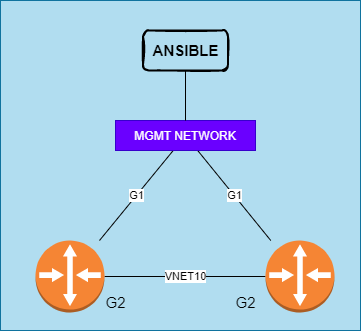
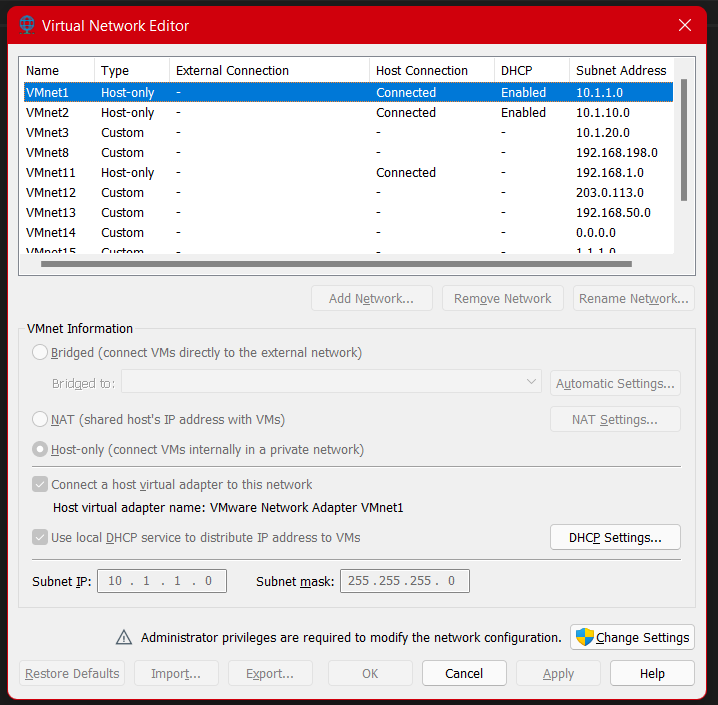
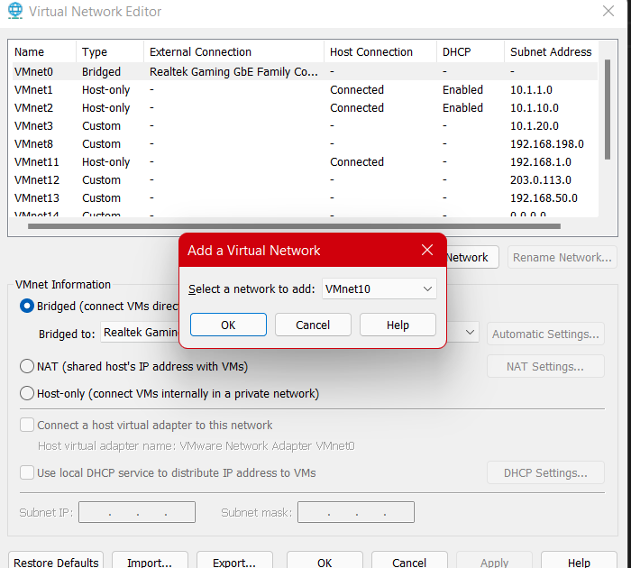
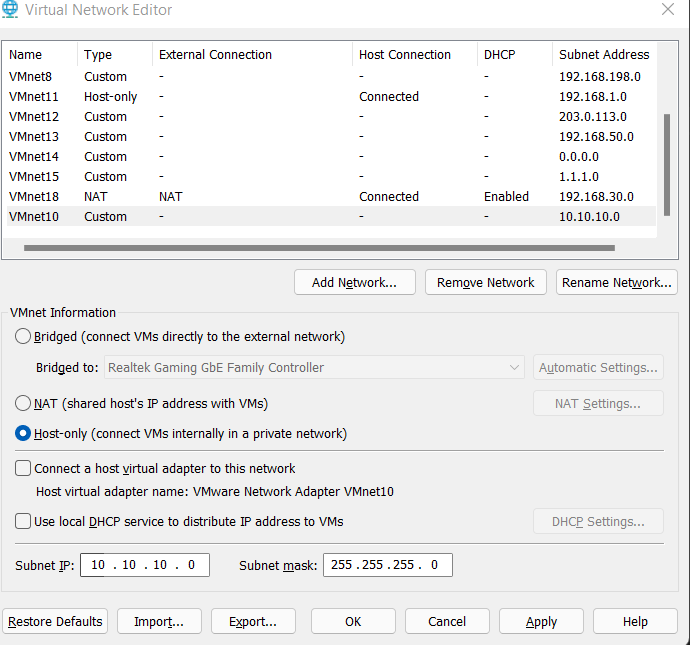
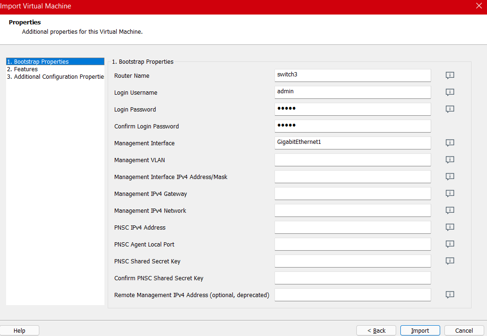
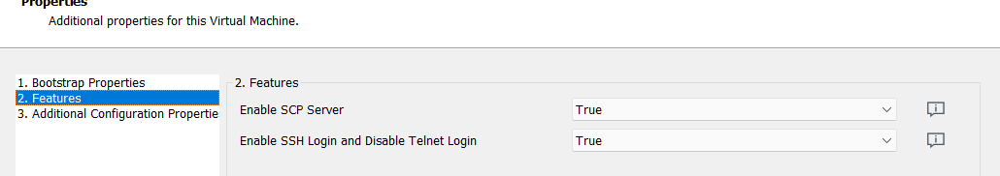
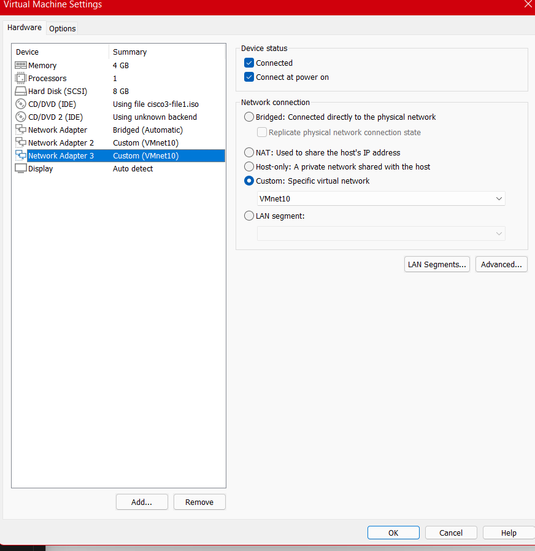

# Build your personal lab environment

## Objective
Build a simple cisco network lab to be able to start building ansible playbooks against.
1. You can deploy it in VMWare workstartion or Oracal VM virtal Box
2. 
3. Download these ova https://drive.google.com/drive/folders/1C-QrAd6CEGqhz0SQ71UbenMRHH3qsgcF?
usp=sharing for next weeks class.


## Configure VMware Workstation
1. Build a VNET10
2. Go to > Virtual Network Editor > 
3. 
4. Click on ```Change Settigns ```
5. Click on ``` Add Network ```
6. 
7. Add a new network.. for example i used vnet10
8. Make it a HOST-ONLY Network ( dont need to)
9. 

## Deploy Cisco OVA
1. Download the CISCO OVA
2. Import the OVA and select "SMALL" deployment
3. Configure the switch basics 
4. 
5. Select Features and enable SCP and SSH 
6. 
7. Click import
8. Assign the network interfaces to the cisco switch
9. Make Network Adapter = Bridged (or what ever your network you want.. this will be your management network)
10. Configure Network Adapter 2 and Network Adapter 3 to VMnet10
11. 
