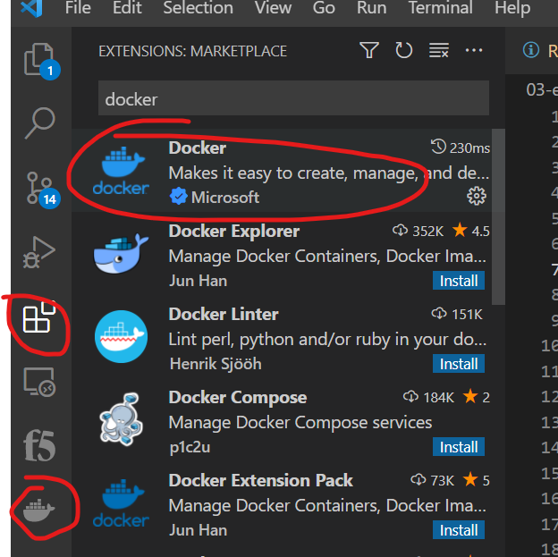
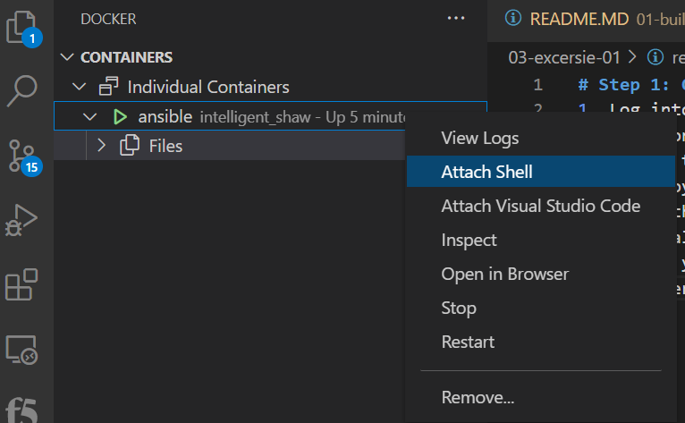
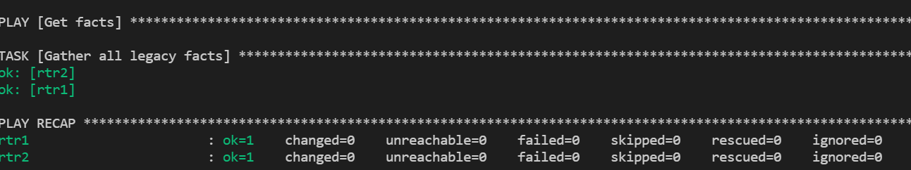

# Step 1: Setup/Connect to your ansible server

Demonstration use of Ansible facts on network infrastructure.

Ansible facts are information derived from speaking to the remote network elements. Ansible facts are returned in structured data (JSON) that makes it easy manipulate or modify. For example a network engineer could create an audit report very quickly using Ansible facts and templating them into a markdown or HTML file.

This exercise will cover:

Building an Ansible Playbook from scratch.
Using ansible-navigator :doc for documentation
Using the cisco.ios.facts module.
Using the debug module.

Explanation of terms:

* namespace - example cisco - A namespace is grouping of multiple collections. The cisco namespace contains multiple collections including ios, nxos, and iosxr.
* collection - example ios - A collection is a distribution format for Ansible content that can include playbooks, roles, modules, and plugins. The ios collection contains all the modules for Cisco IOS/IOS-XE
* module - example facts - Modules are discrete units of code that can be used in a playbook task. For example the facts modules will return structured data about that specified system.


1. Log into your ansible server or deploy the docker from the folder above. 
* <b>Optional</b> if you are using the docker and VS Code.. 
  0. Edit the docker to include you own github account
  1. Deploy the docker ``` docker build . -t ansible ```
  2. Run the docker ``` docker run -it ansible``` 
  3. Install Docker extention in VS Code 
  4. When you click on Docker icon you will see the container is deployed, you can right click on the container and  see the file system, attach the shell..etc
  5. This helps you edit and create files easier using VSCODE

2. Fork this repo to your github account.. https://github.com/TELE36058-Software-Defined-Networks/exercise-week-04-ansible.git 
3. Clone the repo from your account to your ansible server


# Step 3: Connect to your cisco switch and configure the management IP
1. Using VMWare consol log into your cisco switch and go configure gigabitethernet 1 with a management IP address
2. <br> optional </br> you can select ip dhcp (this will grab an ip address from your home network
3. <br> optional </br> you can specificy a static ip

# Step 3: Create your inventory file 
1. You can create an inventory file in linux ``` touch hosts ```
2. Edit your hosts file to include 
3. Start with the following inventory file
4. <br>note</br> change the IPs to the IPs you configured

```
[all:vars]
ansible_user=admin
ansible_password=admin

[routers:children]
cisco

[cisco]
rtr1 ansible_host=192.168.86.170
rtr2 ansible_host=192.168.86.171

[cisco:vars]
ansible_user=admin
ansible_network_os=ios
ansible_connection=network_cli

[dc1]
rtr1
rtr2
```

## Creating the play

Enter the following play definition into facts.yml:

```
---
- name: gather information from routers
  hosts: cisco
  gather_facts: no
```

Here is an explanation of each line:

* The first line, --- indicates that this is a YAML file.
* The - name: keyword is an optional description for this particular Ansible Playbook.
* The hosts: keyword means this playbook against the group cisco defined in the inventory file.
* The gather_facts: no is required since as of Ansible 2.8 and earlier, this only works on Linux hosts, and not network infrastructure. We will use a specific module to gather facts for network equipment.


# Step 4: Create your first Cisco playbook
* Lets create a simple playbook that shows us the version
* Cisco Ansible modules https://docs.ansible.com/ansible/latest/collections/cisco/ios/ios_facts_module.html 
* Cisco ansible galaxy https://galaxy.ansible.com/cisco/ios 
* The docker installs the cisco modules automatically, but if you are not using it you can do it manually on your ansible server ``` ansible-galaxy collection install cisco.ios ```

1. Built our first get facts playbook
2. You can use VI or VSCdoe.. built a get facts playbook calls get_facts.yaml


```
---
- name: Get facts 
  hosts: cisco
  gather_facts: no

  tasks:
    - name: Gather all legacy facts
      cisco.ios.ios_facts:
        gather_subset: all
```

3. Execute your playbook  ``` ansible-playbook get_facts.yaml -i hosts ```
4. If the playbook was successful you will see ok=1 
5. Unfortunaly we didn't get any information printed out.. so lets get more output in our terminal
6. To troubleshoot ansible-playbooks you can use ``` -v ``` to get more detailed information out.. also if you add more ``` -vv ``` you get more info.. if you add 3x or 4x -vvvvv you get more details.. . 
7. Execute  ``` ansible-playbook get_facts.yaml -i hosts -v```
8. View the output
9. Execute  ``` ansible-playbook get_facts.yaml -i hosts -vv```
10. View the output
11. Execute  ``` ansible-playbook get_facts.yaml -i hosts -vvv```
12. View the output

Note: -vvv is the sweat spot for me to troubleshoot my plabooks.. the more you "v" you add the more noice you get.


# Step 5: Create a new get facts playbook with output
Create a playbook that will provide us detailed output for a specific configuration

1. Create a new playbook called get_facts_display.yaml 

```
---
- name:  Display Cisco info
  hosts: cisco
  gather_facts: no

  tasks:
    - name: Display Cisco Info
      cisco.ios.ios_facts:
        gather_subset: all

    - name: Display Model number 
      debug:
        msg: "The IOS model is {{ansible_net_model}}"

```

2. Execute the playbook  ``` ansible-playbook get_facts_display.yaml -i hosts  ```
3. Next edit your playbook and get some more info from the device
4. Get the Version of IOS

```
   - name: Display Version number 
      debug:
        msg: "The IOS Version is {{ansible_net_version}}"
```
5. Execute the playbook to make sure you it works..
6. Execute the same playbook with -vvv and add more functionity into your playbook.. get the hostname { { ansible_net_hostname }}
7. Add {{ ansible_net_hostname }}

```
   - name: Display Switch hostname
      debug:
        msg: "The Hostname of the switch it {{ansible_net_hostname}}"
```

8. Execute the playbook to make it works.
9. Add more data.
10. Now lets print out subdirectories
11. When we execute -vvv after the playbook we saw the following... 

```
"ansible_net_interfaces": {
            "GigabitEthernet1": {
                "bandwidth": 1000000,
                "description": null,
                "duplex": "Full",
                "ipv4": [
                    {
                        "address": "192.168.86.170",
                        "subnet": "24"
                    }
                ],
                "lineprotocol": "up",
```

12. Next lets edit your exiting playbook and get the information of the interface.

```

    - name: Display Interface info
      debug:
        msg: "The GigabitEthernet1 interface is up {{ansible_net_interfaces.GigabitEthernet1.lineprotocol}}"
```

13. Next execute the playbook to make sure you are successful.


## Takeaways
* The ansible command will allow you access to documentation without an internet connection. This documentation also matches the version of Ansible on the control node.
* The cisco.ios.facts module gathers structured data specific for Cisco IOS. There are relevant modules for each network platform. For example there is a junos_facts for Juniper Junos, and a eos_facts for Arista EOS.
* The debug module allows an Ansible Playbook to print values to the terminal window.